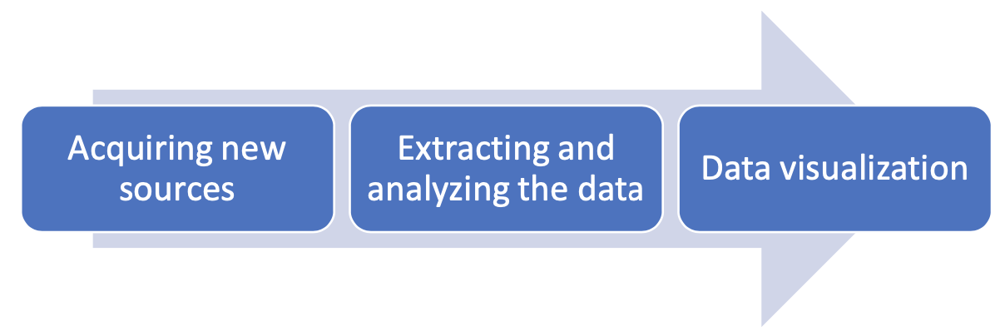

<html>
<body>

<h1>What We Do</h1>

<h3>1. Introduction</h3>

Each year, millions of people are affected by humanitarian emergencies, including disasters and diseases that have traditionally been considered the main threat to human security worldwide. With this project for disaster and diseases monitoring in the Asia- Pacific region, our aim is to be well-prepared and organized about the potential outbreaks of diseases and mitigating the effects of disasters occurring in the region. We intend to achieve this with analyzing data acquired from various sources and thus, reducing the human interaction and the time consumed by the organization workers in the process.

For this project, we devised a process that can acquire information with regards to the number of people affected by particular diseases and environmental disasters. The obtained data would be analyzed and uploaded to a platform that creates plots and graphics for each country and issue.

The process, is divided into three phases:

Each phase and subsequent recurring phases for improving the code to prevent errors and enhancing the performance is explained below in detail.

<h3>2. Acquiring newsources</h3>

<ol type="a">
  <li>What we need?
    
We look for datasets that contain number of people affected by diseases, such as, but not limited to, dengue, measles, diarrhea; and people affected by natural disasters such as, drought, floods, volcanoes and cyclones, among other things.
    

  </li>
  <li>Which countries we cover?
    
The project can cover any country in the Asia-Pacific region. However, the project is devised and developed to cover vulnerable countries, in terms of diseases and environmental disasters, such as Afghanistan, Bangladesh, Indonesia, Myanmar, Nepal, Fiji, French Polynesia, Marshal Islands, Tonga, Pakistan, Philippines, Sri Lanka, Thailand, Viet Nam, Cambodia and Lao.
    

  </li>
  <li>Where we can find the data sets?
    
The most common sources are: Government websites, reports uploaded on ReliefWeb or Uited Nations(UN) Agencies’ websites such as World Health Organisation (WHO) and Humanitarian Data Exchange (HDX). Some examples are:
      <ul>
        <li><a href="http://idengue.arsm.gov.my">iDengueuntukkomuniti - The Government of Malaysia</a></li>
        <li><a href="http://polioeradication.org/polio-today/polio-now/this-week/">Polio Global Eradication Initiative</a></li>
        <li><a href="http://www.epid.gov.lk/web/index.php?option=com_casesanddeaths&Itemid=448&lang=en">Epidemiology Unit of Ministry of Health of Sri Lanka</a></li>
        <li><a href="http://www.edcd.gov.np/ewars">Government of Nepal, Ministry of Health and Population, Department of Health Services, Epidemiology and Disease Control Division</a></li>
        <li><a href="https://reliefweb.int/updates?search=Pacific+Syndromic+Surveillance+System+Weekly+Bulletin">Pacific Syndromic Surveillance System Weekly Bulletin - WHO</a></li>
        <li><a href="https://www.who.int/southeastasia">Epidemiological Highlights - WHO</a></li>
        <li><a href="http://www.dmc.gov.lk/index.php?option=com_dmcreports&view=reports&Itemid=273&report_type_id=1&lang=en">Disaster Management Centre for Safer Communities & Sustainable Development in Sri Lanka</a></li>
      </ul>
    

  </li>
  <li>Dataset requirements
    

      <ul>
        <li>
Dataset have to be updated periodically with the new cases, preferably weekly.
</li>
        <li>
Need to find and acquire data for at least the preceding year and if possible, earlier than that.
</li>
      </ul>
    

  </li>
</ol>

<h3>3. Extracting and preparing the data</h3>

Firstly, for each country and issues thereof, we create a code that extracts data from the selected source. Secondly, refine and analyze the data and lastly, prepare it to be uploaded.

<ol type="a">
  <li>How we extract data?
    
We extract data with Web Scrapping methods using tools such as RStudio. Using regular expressions, we indicate which data is relevant and useful for the project. Each source is different, but the most common instance is that the data is embedded in a web page. For which, we use HTML regular expressions. Further, for the data that is embedded in a PDF, we use plain text regular expressions.
    

  </li>
  <li>Preparing and cleaning the data?
    
The final result has to be the number of cases in a numeric expression. We use different techniques to isolate the number of affected people.
    

  </li>
</ol>

<h3>4. Data visualization</h3>

For the data visualization, we use the Shinny platform to present the data. It is a very convenient tool as it is compatible with Rstudio, which as we said above, we use to extract and prepare the data.

We created a script that automatically run the code for each country/issue and updates the data base with the new cases, each week. The platform is connected to the database and hence, each time the data base is updated the platform is automatically updated. It is configured to create graphics and plots for each country/issue. The Shinny platform is an online platform which makes it easy and convenient to share with the team members.

<h3>5. Codeimprovements</h3>

Our code can be divided in two parts, one for extracting and preparing the data and other for uploading the data to the platform. Both are made with R, a well known language and environment for statistical computing and graphics, that provides a widely range of resources for data analysis. It is free and easy to download and install what makes it very convenient for a project in which different people of the organization might involve.
We periodically review the code and try to improve the methods we use in order to make it more accurate and less dependent of human interaction.

<h3>6. Conclusion</h3>

With this process, we aim to achieve our goal to update every person working in the organization about the diseases and disaster outbreaks in the Asia-Pacific region. Furthermore, as the process is automated, it reduces considerably the time consumed by the team members as compared to a process in which the user manually looks for data in each source and introduce it to the database to create the graphics.

</body>
</html>